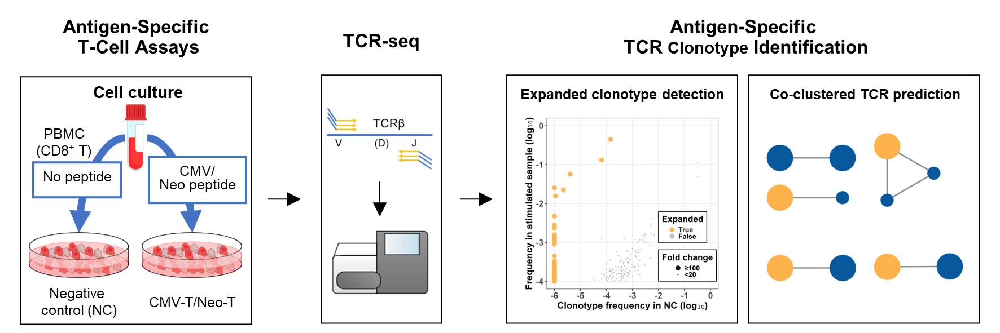

# NeoTCRseek
Ultra-sensitive identification of neoantigen-specific TCR (neoTCR) clonotypes from T-cell products

We introduce NeoTCRseek, an integrated platform that combines extended T-cell culture, deep TCR sequencing, and advanced TCR-clustering tools to enhance neoTCR clonotype identification. NeoTCRseek is designed to identify neoTCR clonotypes in T-cell products for for tracking clinical T-cell dynamics in neoantigen-specific, non-engineered adoptive T-cell therapies.

---

## Pipeline overview



# NeoTCRseek

**NeoTCRseek** is a command-line toolkit for identification of neoantigen-specific TCR (neoTCR) clonotypes from T-cell products. It identifies clonotypes that selectively expand upon peptide stimulation compared with unstimulated controls.

Implemented in Python and R, NeoTCRseek runs on Linux and macOS.

Starting from paired TCR repertoires (stimulated culture vs. control), NeoTCRseek:

1. merges clonotypes,
2. computes fold enrichment,
3. performs statistical testing,
4. detects significantly expanded clones,
5. outputs curated clonotype tables and summary statistics.

The resulting high-confidence TCR candidates can be used for downstream validation and immune monitoring.

------

# Installation

Download the release package:

```
tar zxvf NeoTCRseek_v1.0.0.tar.gz
cd NeoTCRseek_v1.0.0
```

Install the package:

```
pip install .
```

Or install in editable mode for development:

```
pip install -e .
```

Verify installation:

```
neotcrseek --version
```

------

# Input data

NeoTCRseek requires two repertoire files:

- **case sample**: peptide-stimulated culture
- **control sample**: unstimulated culture

Input files should be in NeoTCRseek standard format or converted from VDJtools format.

To convert VDJtools format:

```
neotcrseek convert \
  --infile vdjtools.tsv \
  --outfile converted.tsv
```

------

# Detect expanded TCR clonotypes

Run detection:

```
neotcrseek detect \
  --case case.tsv \
  --control control.tsv \
  --fc-threshold 300 \
  --case-freq-cutoff 0.00001 \
  --fdr-threshold 1 \
  --control-freq-threshold 0 \
  --outdir result/
```

Default parameters:

```
FC threshold           = 300
case freq cutoff       = 1e-4
FDR threshold          = 1
control freq threshold = 0
```

Outputs:

```
result/
├── expanded_TCRs.txt
└── expanded_TCRs.stat.txt
```

------

## Example with custom thresholds

```
neotcrseek detect \
  --case case.tsv \
  --control control.tsv \
  --fc-threshold 1000 \
  --case-freq-cutoff 1e-4 \
  --fdr-threshold 0.01 \
  --out result/
```

------

# Plot expansion results

Example R script for visualization:

```
Rscript plot_freq_dotplot.R \
  result/expanded_TCRs.txt \
  expanded_TCRs.png sample_name
```

This generates a scatter plot comparing clone frequencies between control and stimulated samples.

------

# Run the example pipeline

An example workflow is provided:

```
cd example
bash example.sh
```

This runs the complete pipeline on sample data.

------

# Output files

## expanded_TCRs.txt

Contains detected clonotypes with statistics:

- clonotype sequence
- frequencies in case/control
- fold change
- Fisher test results
- FDR values
- expansion status

------

## expanded_TCRs.stat.txt

Summary statistics:

- number of clones per sample
- number of expanded clones
- frequency summary
- filtering parameters used

------

# License

See LICENSE file for details.

------

# Contact

For questions or suggestions, please contact:

```
songofbin@gmail.com
```